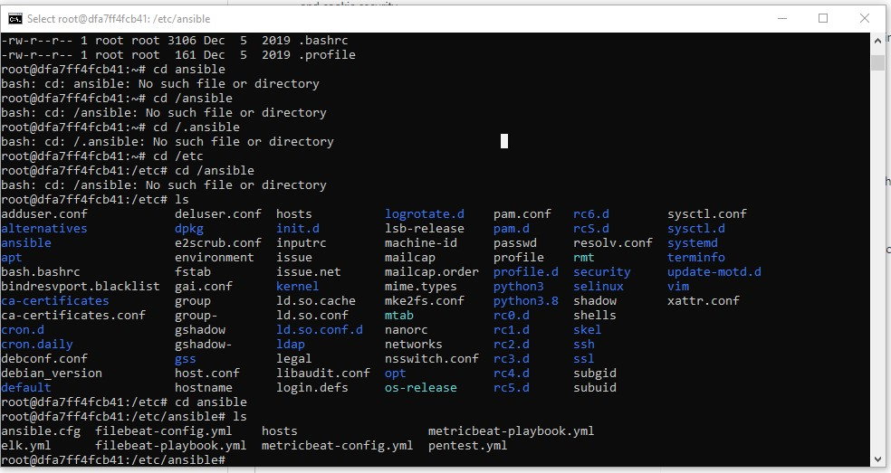

## Automated ELK Stack Deployment -

The files in this repository were used to configure the network depicted below.

These files have been tested and used to generate a live ELK deployment on Azure. They can be used to either recreate the entire deployment pictured above. Alternatively, select portions of the ansbile script (yml) file may be used to install only certain pieces of it, such as Filebeat.
- Playbooks
  - [elk.yml](Ansible/elk.yml)
  - [pentest.yml](Ansible/pentest.yml)
  - [filebeat-playbook.yml](Ansible/filebeat-playbook.yml)
  - [metricbeat-playbook.yml](Ansible/metricbeat-playbook.yml)
  - 
  
- Configuration Files
  - [filebeat-config.yml](Ansible/filebeat-config.yml)
  - [metricbeat-config.yml](Ansible/metricbeat-config.yml)
  - [ansible.cfg](Ansible/ansible.cfg)
  - [hosts](Ansible/hosts.txt)

This document contains the following details:
- Description of the Topologu
- Access Policies
- ELK Configuration
  - Beats in Use
  - Machines Being Monitored
- How to Use the Ansible Build

### Description of the Topology

The main purpose of this network is to expose a load-balanced and monitored instance of DVWA, the D*mn Vulnerable Web Application.

Load balancing ensures that the application will be highly available, in addition to restricting unauthorised access to the network.
- _What aspect of security do load balancers protect? What is the advantage of a jump box?_
- Load Balancers protect the availabilty of the servers, and will switch loads in between the servers so that no individual server is unable to respond to requests, and the queries are distributed among the servers in the Load balancer backend pool.
- Jump box offers security and isolates points of entry to the network.Only SSH can be used on the allowed orignationg IP addresses.
- Integrating an ELK server allows users to easily monitor the vulnerable VMs for changes to the configuration_ and system logs.
- What does Filebeat watch for?_
- Filebeat monitors for SSH logins, Linux Logins and Sudo Commands.
- What does Metricbeat record?_
- Metric Beats records CPU, Memory, and Network usage. (In real time)

The configuration details of each machine may be found below.
_Note: Use the [Markdown Table Generator](http://www.tablesgenerator.com/markdown_tables) to add/remove values from the table_.

| Name     | Function | IP Address | Operating System |
|----------|----------|------------|------------------|
| Jump Box | Gateway  | 10.1.0.4   | Linux            |
| Web1  |      Web Server    |         10.1.0.7   |     Linux             |
|Web 2   |    Web Server      |        10.1.0.8         |   Linux          |
| Web 3   |   Web Server       |        10.1.0.9         |     Linux          |
| Elk Server   |   Monitoring Solution (Log & Metrics)       | 20.92.95.248           |   Linux               |

### Access Policies

The machines on the internal network are not exposed to the public Internet. 

- Only the Jump Host machine and the Web Servers (1,2,3) can accept connections from the Internet. Access to this machine is only allowed from the following IP addresses: My home IP address - 101.181.66.75

Machines within the network can only be accessed by Jump Box.
-Which machine did you allow to access your ELK VM? What was its IP address?_
- Jump Box IP was permitted to access the ELK Server via SSH and ELK IP was 10.2.0.4
- Summary of the access policies in place can be found in the table below.

| Name     | Publicly Accessible | Allowed IP Addresses |
|----------|---------------------|----------------------|
| Jump Box | Yes             | My home 101.181.66.75  |
|   Web 1       |      Yes               |         Any             |
|      Web 2    |       Yes              |           Any           |
|      Web 3   |        Yes             |         Any             |

### Elk Configuration

Ansible was used to automate configuration of the ELK machine. No configuration was performed manually, which is advantageous because...
- Reduces repetitive work on the servers to be managed.
- Increases efficinenty by reducitng errors
- Source control is effective

The playbook implements the following tasks:
- Install/Update Docker
- Install Python modules
- Created and started a container
- Enabled Container on boot
- Updated hosts file to include the Web VM Ips
- Update ansible.cfg file with the username

The following screenshot displays the result of running `docker ps` after successfully configuring the ELK instance.

### Target Machines & Beats
This ELK server is configured to monitor the following machines:
- 10.1.0.5
- 

We have installed the following Beats on these machines:
- File Beat
- Metric Beat
These Beats allow us to collect the following information from each machine:
-Filebeat collects system log information, sudo commands and logins
- Metric Beat collects system health, CPU, RAM, resource usage in real time.

### Using the Playbook
In order to use the playbook, you will need to have an Ansible control node already configured. Assuming you have such a control node provisioned: 

SSH into the control node and follow the steps below:
- Copy the config file to etc folder (respectively for programs installed filebeat and metricbeat)
- Update the host file to include the IP addresses of the Servers to be updated.
- Run the playbook, and navigate to  Web VMs or ELK Server to check that the installation worked as expected.Tried to access DWWA web.

_TODO: Answer the following questions to fill in the blanks:_
- _Which file is the playbook? Where do you copy it?_
- ansible 
- _Which file do you update to make Ansible run the playbook on a specific machine? How do I specify which machine to install the ELK server on versus which to install Filebeat on?_
- _Which URL do you navigate to in order to check that the ELK server is running?
http://20.92.95.248:5601/app/kibana:5601
- only IP entries of the Web servers entries to the host file  will be updated.

